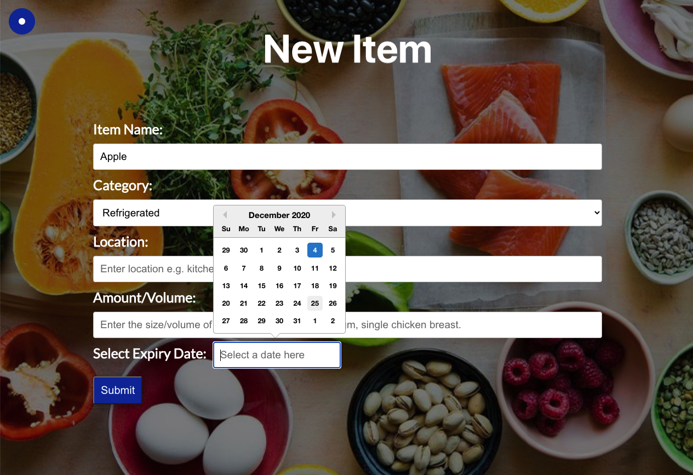

# What Should I Eat? App

A pantry inventory application, where users can add items with expiry and volume without an accout. The use of localStorage instead of building a backend database was to make the user experience easy and removed reasons why a user may not engage with the app. 

## Motivation
The project was created for someone who has a large pantry, two fridges and two freezers. Keeping track of what they have in each area is difficult. The app was designed to allow them to easily input each item, sort items in any way they want and track items close to expiry so there was no incidental food wastage. 

## Build 
Live Link [HERE](http://scattered-bead.surge.sh/#/)

## User Stories
* A freezer/fridge/pantry inventory app. Where you can add items (in any format you like), set a “use by” date, remove portions, filter and delete.
* To solve the issue of waste, overspending,  and to assist with portion sizing. 

## Future User Stories
* As a user, I would like to be able to use this app from any device, so I can not loose my data if I reset my computer. 
* Be able to activate an alert to users of items close to use by. 

## Technical Tasks/ Trello Board
[Trello Board link](https://trello.com/b/evmWHjQg/what-should-i-eat) with associated ToDo/Doing/Done and Technical Tasks.

## Technical Problems to Solve
* Local storage.
* Calculate date difference to get expiry date.
* Display items close to expiry when 'What Should I Eat?' button is selected. 
* Display list of all items in a selection of order, including category, expiry date. 
* Add date picker/calendar.

## Screenshoots

# Technology Used
* React
* Local Storage
* Surge for deployment

## Dependencies
* react-router-dom
* react-datepicker
* moment

